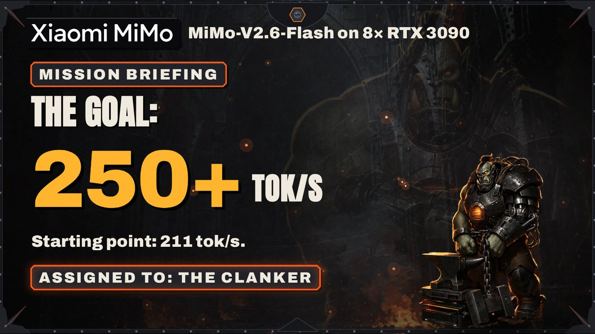

# multigpu-p2p-tweaks

Changes that made an 8x RTX 3090 Linux inference box faster and safer to run. Each directory
stands on its own.

The mimo-mtp3 result as a 45 second film (click the poster to play the mp4).

`vllm-custom-allreduce/` forces vLLM's custom all-reduce on more than two PCIe GPUs when P2P
works. Single-stream decode on GLM-5.3-Flash TP8 went from 68.5 to 86.5 t/s. With
`expandable_segments` off it also frees KV memory: bigger context windows on MiMo and
Qwen3.8-Flash-Next.

`mimo-mtp3/` makes vLLM use all three of MiMo-V2.6-Flash's MTP modules instead of one, fed the
way SGLang feeds them. Single-stream decode 211 -> 253 t/s on TP8.

`glm-sparse-mla-fp8kv/` is a patch for wtdcode/vllm-backport that allows an fp8_e5m2 KV cache
for GLM-5.3-Flash on Ampere. Context window 65,536 -> 159,744 at the same decode speed.

`gpu-temp-guard/` is a small systemd service that trims a card's power limit when its hotspot
or VRAM runs too hot and gives it back once it cools.

`driver/` has setup notes for the community P2P driver on same-generation consumer cards and
a script to check peer access and measure copy bandwidth.

Mixed Ampere + Blackwell box: [p2p-mixed-arch-fix](https://github.com/loktar00/p2p-mixed-arch-fix).

Test box: 8x RTX 3090 (four NVLink pairs, mix of x16 and x4 slots), NVIDIA 595.58.03,
Linux 6.17. Numbers in each README are from that box.

## Quick start

P2P driver: follow `driver/README.md`, then

    nvidia-smi topo -p2p r
    python3 driver/p2p_check.py

vLLM custom all-reduce (needs working P2P between all ranks):

    mkdir -p /opt/vllm-force-ca && cp vllm-custom-allreduce/sitecustomize.py /opt/vllm-force-ca/
    PYTHONPATH=/opt/vllm-force-ca CA_MAX_BYTES=8192 NCCL_P2P_LEVEL=SYS vllm serve <model> --tensor-parallel-size 8

Don't set `PYTORCH_CUDA_ALLOC_CONF=expandable_segments:True` with it.

MiMo-V2.6-Flash with three MTP modules (stacks with the all-reduce overlay):

    mkdir -p /opt/vllm-mimo-mtp3 && cp mimo-mtp3/sitecustomize.py /opt/vllm-mimo-mtp3/
    PYTHONPATH=/opt/vllm-mimo-mtp3:/opt/vllm-force-ca CA_MAX_BYTES=8192 NCCL_P2P_LEVEL=SYS \
    vllm serve <MiMo-V2.6-Flash> --tensor-parallel-size 8 \
        --speculative-config '{"method":"mtp","num_speculative_tokens":3,"use_local_argmax_reduction":true}'

GLM-5.3-Flash fp8 KV on vllm-backport: apply `glm-sparse-mla-fp8kv/fp8kv.patch` to a copy of
the tree, then serve with `--kv-cache-dtype fp8_e5m2` and `VLLM_INDEXER_PREFILL_BUFFER_FACTOR=8`.

Temperature guard (needs [gputemps](https://github.com/ThomasBaruzier/gddr6-core-junction-vram-temps)):

    sudo gpu-temp-guard/install.sh
    sudo gpu-temp-guard --dry-run --verbose --polls 3
    sudo systemctl enable --now gpu-temp-guard

`AGENTS.md` has the same steps with prerequisite checks and rollback, written for a coding
agent to follow.

## Credits

- [NVIDIA open-gpu-kernel-modules](https://github.com/NVIDIA/open-gpu-kernel-modules), the
  open kernel driver everything P2P here runs on. MIT, dual MIT/GPLv2 when built as a module.
- [tinygrad/open-gpu-kernel-modules](https://github.com/tinygrad/open-gpu-kernel-modules),
  the original P2P patch for consumer cards.
- [aikitoria/open-gpu-kernel-modules](https://github.com/aikitoria/open-gpu-kernel-modules),
  the maintained P2P fork for current drivers, NVLink fallback included. This repo uses it
  as-is and ships none of its code.
- [vLLM](https://github.com/vllm-project/vllm) (Apache-2.0). The overlays patch it at
  runtime; no vLLM code is copied.
- [wtdcode/vllm-backport](https://github.com/wtdcode/vllm-backport) (Apache-2.0), the vLLM tree
  GLM-5.3-Flash runs on here; `fp8kv.patch` modifies it.
- [SGLang](https://github.com/sgl-project/sglang) (Apache-2.0), whose MiMo MTP handling
  `mimo-mtp3` follows.
- [Xiaomi MiMo](https://github.com/XiaomiMiMo) for MiMo-V2.6-Flash, Z.ai for GLM-5.3-Flash.
- [ThomasBaruzier/gddr6-core-junction-vram-temps](https://github.com/ThomasBaruzier/gddr6-core-junction-vram-temps)
  (Apache-2.0), `gputemps`, which the guard reads. It builds on
  [olealgoritme/gddr6](https://github.com/olealgoritme/gddr6) and
  [jjziets/gddr6_temps](https://github.com/jjziets/gddr6_temps), plus the register findings
  credited in its README.

## License

MIT, see `LICENSE`, except `glm-sparse-mla-fp8kv/fp8kv.patch`, which modifies vLLM files and
is Apache-2.0 like them (`glm-sparse-mla-fp8kv/LICENSE.Apache-2.0`). No other code from the
projects above is included.
